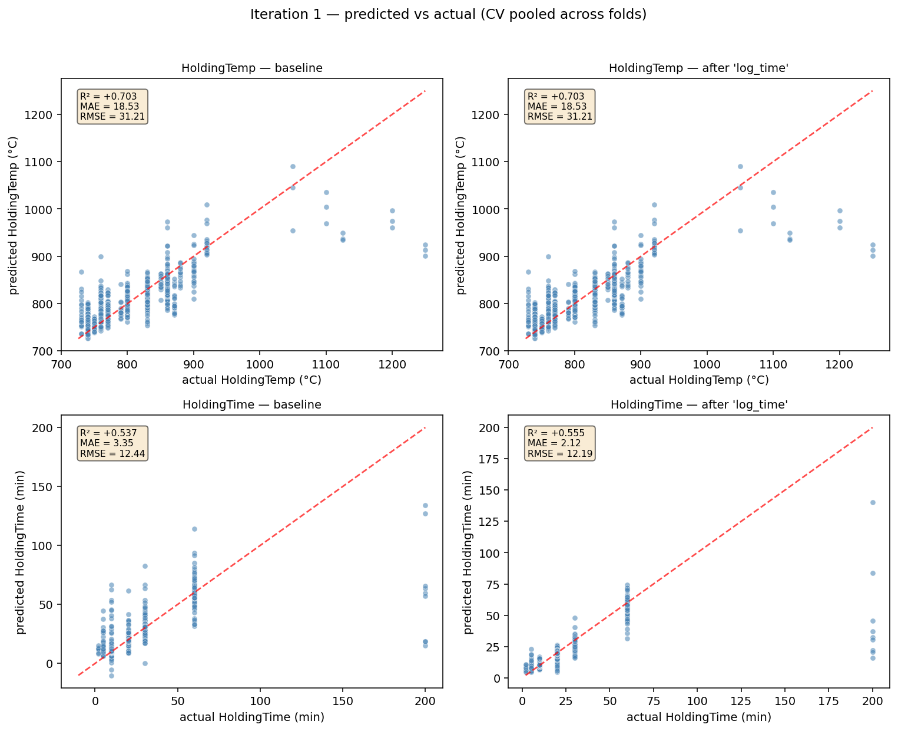

# Iteration 1

_Generated: 2026-05-04 12:26:43 PDT_

## Baseline going in

- Cumulative stack: `none — vanilla baseline`
- Folds: 15

| target | R² | MAE | RMSE |
|---|---|---|---|
| HoldingTemp | `+0.7106 ± 0.0638` | `18.53` | `30.35` |
| HoldingTime | `+0.6503 ± 0.2197` | `3.35` | `10.27` |
| **mean R²** | `+0.6805` | | |

## Candidates tested this iteration

### `log_time` — ✅ accepted

Wrap HoldingTime target with log1p / expm1. The time range (10 to 90+ minutes) is roughly log-uniform, so linear-MSE over-weights long-time samples.

**Diff:**

```python
from sklearn.compose import TransformedTargetRegressor
model = TransformedTargetRegressor(
    regressor=GradientBoostingRegressor(...),
    func=np.log1p, inverse_func=np.expm1)
```

**Per-target metrics (Δ vs baseline):**

| target | R² | Δ R² | MAE | Δ MAE | RMSE | Δ RMSE |
|---|---|---|---|---|---|---|
| HoldingTemp | `+0.7106` | `+0.0000` | `18.53` | `+0.00` | `30.35` | `+0.00` |
| HoldingTime | `+0.7646` | `+0.1143` | `2.12` | `-1.23` | `8.42` | `-1.85` |
| **mean R²** | `+0.7376` | `+0.0571` | | | | |

_Wall time: `387.2s`_

### `per_target` — ❌ rejected

Train two independent single-output GBRs (one per target) instead of MultiOutputRegressor wrapping a joint multi-output GBR. Decouples the two targets so each tree depth/split can specialise.

**Diff:**

```python
# before:
model = MultiOutputRegressor(GradientBoostingRegressor(...))
# after:
m_temp = GradientBoostingRegressor(...)  # fits Y[:, 0] only
m_time = GradientBoostingRegressor(...)  # fits Y[:, 1] only
```

**Per-target metrics (Δ vs baseline):**

| target | R² | Δ R² | MAE | Δ MAE | RMSE | Δ RMSE |
|---|---|---|---|---|---|---|
| HoldingTemp | `+0.7106` | `+0.0000` | `18.53` | `+0.00` | `30.35` | `+0.00` |
| HoldingTime | `+0.6503` | `+0.0000` | `3.35` | `+0.00` | `10.27` | `+0.00` |
| **mean R²** | `+0.6805` | `+0.0000` | | | | |

_Wall time: `389.8s`_

### `stratify_alloy` — ✅ accepted

Use StratifiedKFold by alloy for the first CV repeat so every alloy is represented in both train and test in each fold.

**Diff:**

```python
skf = StratifiedKFold(n_splits=5, shuffle=True, random_state=SEED)
folds = list(skf.split(X, df_c1['alloy']))
```

**Per-target metrics (Δ vs baseline):**

| target | R² | Δ R² | MAE | Δ MAE | RMSE | Δ RMSE |
|---|---|---|---|---|---|---|
| HoldingTemp | `+0.7163` | `+0.0057` | `18.42` | `-0.10` | `30.12` | `-0.24` |
| HoldingTime | `+0.6892` | `+0.0388` | `3.14` | `-0.21` | `9.45` | `-0.82` |
| **mean R²** | `+0.7027` | `+0.0223` | | | | |

_Wall time: `395.8s`_

### `stratify_temp_bin` — ✅ accepted

Use StratifiedKFold by HoldingTemp quantile-bin (5 bins) so rare setpoints aren't entirely on one side of the split.

**Diff:**

```python
y_bin = pd.qcut(Y[:, 0], q=5, duplicates='drop').astype(str)
skf = StratifiedKFold(n_splits=5, shuffle=True, random_state=SEED)
folds = list(skf.split(X, y_bin))
```

**Per-target metrics (Δ vs baseline):**

| target | R² | Δ R² | MAE | Δ MAE | RMSE | Δ RMSE |
|---|---|---|---|---|---|---|
| HoldingTemp | `+0.7059` | `-0.0047` | `18.48` | `-0.04` | `30.57` | `+0.22` |
| HoldingTime | `+0.6973` | `+0.0470` | `3.17` | `-0.18` | `9.39` | `-0.88` |
| **mean R²** | `+0.7016` | `+0.0211` | | | | |

_Wall time: `396.2s`_

## Outcome

**Winner: `log_time`** (Δ mean R² = `+0.0571`)

Folded into the baseline. New cumulative stack: `['log_time']`

### Predicted vs actual — baseline vs winner


