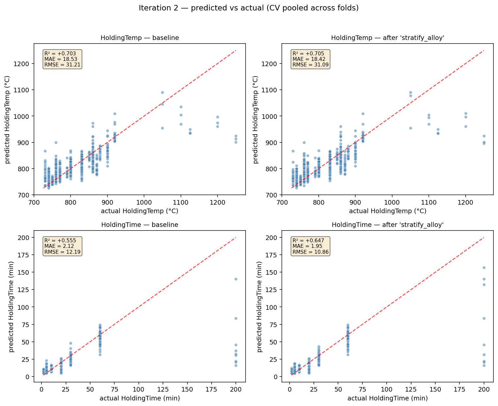

# Iteration 2

_Generated: 2026-05-04 12:46:13 PDT_

## Baseline going in

- Cumulative stack: `['log_time']`
- Folds: 15

| target | R² | MAE | RMSE |
|---|---|---|---|
| HoldingTemp | `+0.7106 ± 0.0638` | `18.53` | `30.35` |
| HoldingTime | `+0.7646 ± 0.2927` | `2.12` | `8.42` |
| **mean R²** | `+0.7376` | | |

## Candidates tested this iteration

### `per_target` — ❌ rejected

Train two independent single-output GBRs (one per target) instead of MultiOutputRegressor wrapping a joint multi-output GBR. Decouples the two targets so each tree depth/split can specialise.

**Diff:**

```python
# before:
model = MultiOutputRegressor(GradientBoostingRegressor(...))
# after:
m_temp = GradientBoostingRegressor(...)  # fits Y[:, 0] only
m_time = GradientBoostingRegressor(...)  # fits Y[:, 1] only
```

**Per-target metrics (Δ vs baseline):**

| target | R² | Δ R² | MAE | Δ MAE | RMSE | Δ RMSE |
|---|---|---|---|---|---|---|
| HoldingTemp | `+0.7106` | `+0.0000` | `18.53` | `+0.00` | `30.35` | `+0.00` |
| HoldingTime | `+0.7646` | `+0.0000` | `2.12` | `+0.00` | `8.42` | `+0.00` |
| **mean R²** | `+0.7376` | `+0.0000` | | | | |

_Wall time: `384.6s`_

### `stratify_alloy` — ✅ accepted

Use StratifiedKFold by alloy for the first CV repeat so every alloy is represented in both train and test in each fold.

**Diff:**

```python
skf = StratifiedKFold(n_splits=5, shuffle=True, random_state=SEED)
folds = list(skf.split(X, df_c1['alloy']))
```

**Per-target metrics (Δ vs baseline):**

| target | R² | Δ R² | MAE | Δ MAE | RMSE | Δ RMSE |
|---|---|---|---|---|---|---|
| HoldingTemp | `+0.7163` | `+0.0057` | `18.42` | `-0.10` | `30.12` | `-0.24` |
| HoldingTime | `+0.8000` | `+0.0354` | `1.95` | `-0.17` | `7.68` | `-0.74` |
| **mean R²** | `+0.7581` | `+0.0206` | | | | |

_Wall time: `388.8s`_

### `stratify_temp_bin` — ✅ accepted

Use StratifiedKFold by HoldingTemp quantile-bin (5 bins) so rare setpoints aren't entirely on one side of the split.

**Diff:**

```python
y_bin = pd.qcut(Y[:, 0], q=5, duplicates='drop').astype(str)
skf = StratifiedKFold(n_splits=5, shuffle=True, random_state=SEED)
folds = list(skf.split(X, y_bin))
```

**Per-target metrics (Δ vs baseline):**

| target | R² | Δ R² | MAE | Δ MAE | RMSE | Δ RMSE |
|---|---|---|---|---|---|---|
| HoldingTemp | `+0.7059` | `-0.0047` | `18.48` | `-0.04` | `30.57` | `+0.22` |
| HoldingTime | `+0.7999` | `+0.0353` | `2.03` | `-0.09` | `7.80` | `-0.63` |
| **mean R²** | `+0.7529` | `+0.0153` | | | | |

_Wall time: `395.1s`_

## Outcome

**Winner: `stratify_alloy`** (Δ mean R² = `+0.0206`)

Folded into the baseline. New cumulative stack: `['log_time', 'stratify_alloy']`

### Predicted vs actual — baseline vs winner


