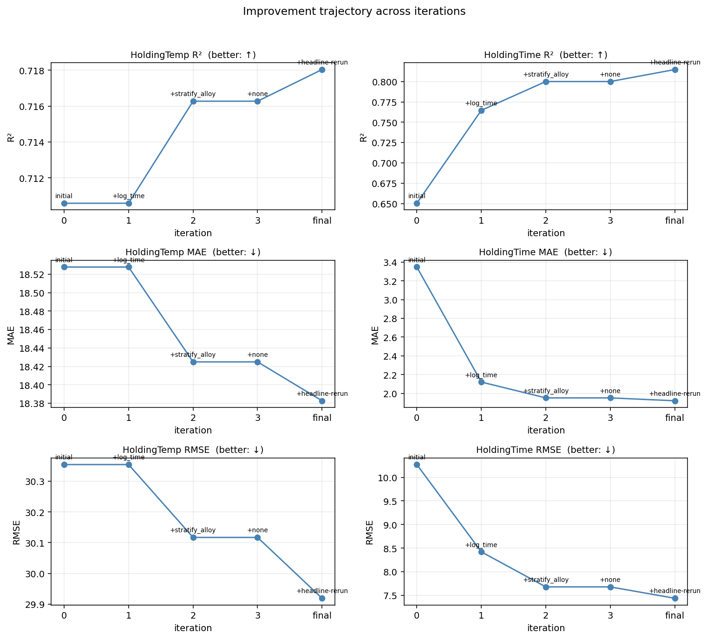

# Iteration summary — `microstructure_demo` improvement loop

_Run id: `20260504_115403_caa5`_
_Updated: 2026-05-04 13:20:30 PDT_

## Initial baseline

- HoldingTemp R²: `+0.7106 ± 0.0638`
- HoldingTime R²: `+0.6503 ± 0.2197`
- Mean R²       : `+0.6805`

## Per-iteration cumulative metrics

Each row reflects the full metric set *after* the winning strategy of that iteration is folded into the baseline.

| # | Winner | Δ mean R² | Temp R² | Time R² | Mean R² | Temp MAE | Time MAE | Temp RMSE | Time RMSE | Stack |
|---|---|---|---|---|---|---|---|---|---|---|
| 0 | `(baseline)` | — | `+0.7106` | `+0.6503` | `+0.6805` | `18.53` | `3.35` | `30.35` | `10.27` | `(baseline)` |
| 1 | `log_time` | `+0.0571` | `+0.7106` | `+0.7646` | `+0.7376` | `18.53` | `2.12` | `30.35` | `8.42` | `log_time` |
| 2 | `stratify_alloy` | `+0.0206` | `+0.7163` | `+0.8000` | `+0.7581` | `18.42` | `1.95` | `30.12` | `7.68` | `log_time, stratify_alloy` |
| 3 | `(none — stop)` | `+0.0000` | `+0.7163` | `+0.8000` | `+0.7581` | `18.42` | `1.95` | `30.12` | `7.68` | `log_time, stratify_alloy` |
| final | `(headline-rerun)` | `+0.0000` | `+0.7180` | `+0.8148` | `+0.7664` | `18.38` | `1.92` | `29.92` | `7.44` | `log_time, stratify_alloy` |

## Final state vs initial

| metric | initial | final | Δ |
|---|---|---|---|
| HoldingTemp R² | `+0.7106` | `+0.7180` | `+0.0074` |
| HoldingTime R² | `+0.6503` | `+0.8148` | `+0.1644` |
| Mean R²        | `+0.6805` | `+0.7664` | `+0.0859` |
| HoldingTemp MAE | `18.53` | `18.38` | `-0.14` |
| HoldingTime MAE | `3.35` | `1.92` | `-1.43` |
| HoldingTemp RMSE | `30.35` | `29.92` | `-0.43` |
| HoldingTime RMSE | `10.27` | `7.44` | `-2.83` |

### Improvement trajectory

