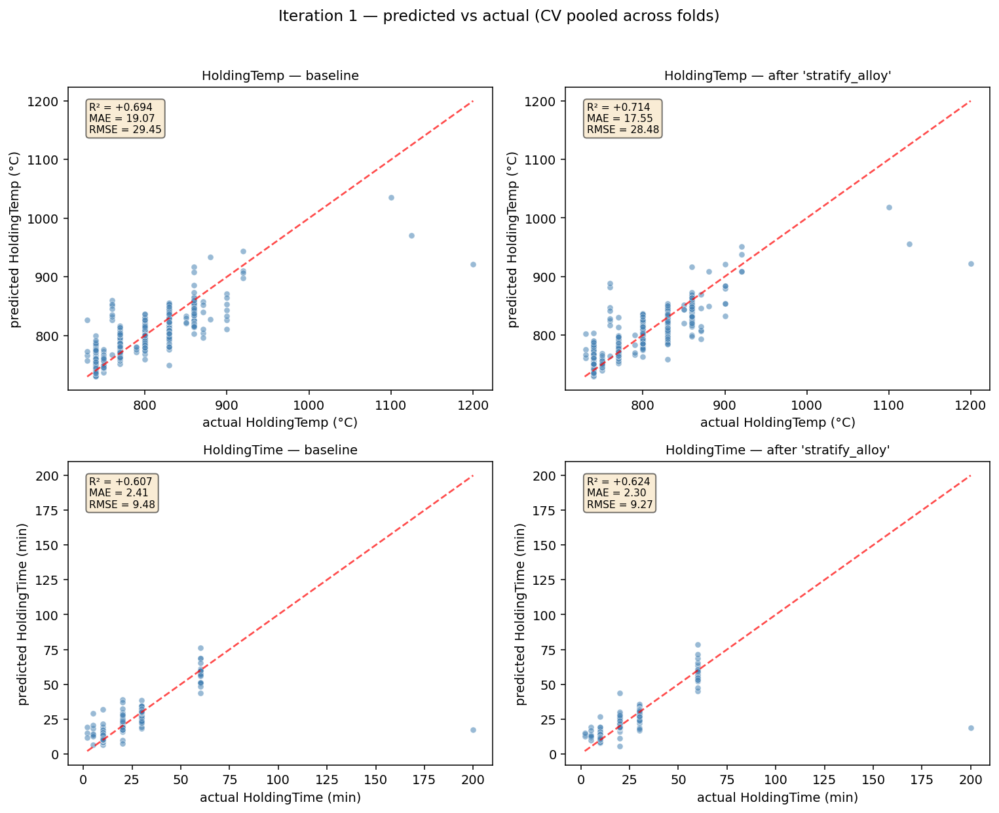

# Iteration 1

_Generated: 2026-05-04 13:49:06 PDT_

## Baseline going in

- Cumulative stack: `none — vanilla baseline`
- Folds: 5

| target | R² | MAE | RMSE |
|---|---|---|---|
| HoldingTemp | `+0.6904 ± 0.0509` | `19.07` | `29.11` |
| HoldingTime | `+0.7500 ± 0.2275` | `2.41` | `7.26` |
| **mean R²** | `+0.7202` | | |

## Candidates tested this iteration

### `log_time` — ✅ accepted

Wrap HoldingTime target with log1p / expm1. The time range (10 to 90+ minutes) is roughly log-uniform, so linear-MSE over-weights long-time samples.

**Diff:**

```python
from sklearn.compose import TransformedTargetRegressor
model = TransformedTargetRegressor(
    regressor=GradientBoostingRegressor(...),
    func=np.log1p, inverse_func=np.expm1)
```

**Per-target metrics (Δ vs baseline):**

| target | R² | Δ R² | MAE | Δ MAE | RMSE | Δ RMSE |
|---|---|---|---|---|---|---|
| HoldingTemp | `+0.6904` | `+0.0000` | `19.07` | `+0.00` | `29.11` | `+0.00` |
| HoldingTime | `+0.7697` | `+0.0198` | `2.05` | `-0.36` | `6.88` | `-0.38` |
| **mean R²** | `+0.7300` | `+0.0099` | | | | |

_Wall time: `107.7s`_

### `per_target` — ❌ rejected

Train two independent single-output GBRs (one per target) instead of MultiOutputRegressor wrapping a joint multi-output GBR. Decouples the two targets so each tree depth/split can specialise.

**Diff:**

```python
# before:
model = MultiOutputRegressor(GradientBoostingRegressor(...))
# after:
m_temp = GradientBoostingRegressor(...)  # fits Y[:, 0] only
m_time = GradientBoostingRegressor(...)  # fits Y[:, 1] only
```

**Per-target metrics (Δ vs baseline):**

| target | R² | Δ R² | MAE | Δ MAE | RMSE | Δ RMSE |
|---|---|---|---|---|---|---|
| HoldingTemp | `+0.6904` | `+0.0000` | `19.07` | `+0.00` | `29.11` | `+0.00` |
| HoldingTime | `+0.7500` | `+0.0000` | `2.41` | `+0.00` | `7.26` | `+0.00` |
| **mean R²** | `+0.7202` | `+0.0000` | | | | |

_Wall time: `108.1s`_

### `stratify_alloy` — ✅ accepted

Use StratifiedKFold by alloy for the first CV repeat so every alloy is represented in both train and test in each fold.

**Diff:**

```python
skf = StratifiedKFold(n_splits=5, shuffle=True, random_state=SEED)
folds = list(skf.split(X, df_c1['alloy']))
```

**Per-target metrics (Δ vs baseline):**

| target | R² | Δ R² | MAE | Δ MAE | RMSE | Δ RMSE |
|---|---|---|---|---|---|---|
| HoldingTemp | `+0.7106` | `+0.0202` | `17.55` | `-1.52` | `27.75` | `-1.36` |
| HoldingTime | `+0.7760` | `+0.0260` | `2.30` | `-0.11` | `6.89` | `-0.37` |
| **mean R²** | `+0.7433` | `+0.0231` | | | | |

_Wall time: `108.6s`_

### `stratify_temp_bin` — ❌ rejected

Use StratifiedKFold by HoldingTemp quantile-bin (5 bins) so rare setpoints aren't entirely on one side of the split.

**Diff:**

```python
y_bin = pd.qcut(Y[:, 0], q=5, duplicates='drop').astype(str)
skf = StratifiedKFold(n_splits=5, shuffle=True, random_state=SEED)
folds = list(skf.split(X, y_bin))
```

**Per-target metrics (Δ vs baseline):**

| target | R² | Δ R² | MAE | Δ MAE | RMSE | Δ RMSE |
|---|---|---|---|---|---|---|
| HoldingTemp | `+0.6655` | `-0.0249` | `18.47` | `-0.61` | `30.49` | `+1.38` |
| HoldingTime | `+0.7846` | `+0.0346` | `2.38` | `-0.02` | `6.77` | `-0.49` |
| **mean R²** | `+0.7250` | `+0.0048` | | | | |

_Wall time: `108.3s`_

## Outcome

**Winner: `stratify_alloy`** (Δ mean R² = `+0.0231`)

Folded into the baseline. New cumulative stack: `['stratify_alloy']`

### Predicted vs actual — baseline vs winner


