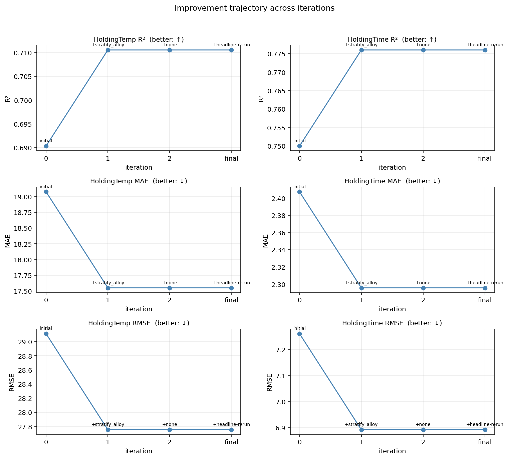

# Iteration summary — `microstructure_demo` improvement loop

_Run id: `20260504_134006_1027`_
_Updated: 2026-05-04 13:56:17 PDT_

## Initial baseline

- HoldingTemp R²: `+0.6904 ± 0.0509`
- HoldingTime R²: `+0.7500 ± 0.2275`
- Mean R²       : `+0.7202`

## Per-iteration cumulative metrics

Each row reflects the full metric set *after* the winning strategy of that iteration is folded into the baseline.

| # | Winner | Δ mean R² | Temp R² | Time R² | Mean R² | Temp MAE | Time MAE | Temp RMSE | Time RMSE | Stack |
|---|---|---|---|---|---|---|---|---|---|---|
| 0 | `(baseline)` | — | `+0.6904` | `+0.7500` | `+0.7202` | `19.07` | `2.41` | `29.11` | `7.26` | `(baseline)` |
| 1 | `stratify_alloy` | `+0.0231` | `+0.7106` | `+0.7760` | `+0.7433` | `17.55` | `2.30` | `27.75` | `6.89` | `stratify_alloy` |
| 2 | `(none — stop)` | `+0.0000` | `+0.7106` | `+0.7760` | `+0.7433` | `17.55` | `2.30` | `27.75` | `6.89` | `stratify_alloy` |
| final | `(headline-rerun)` | `+0.0000` | `+0.7106` | `+0.7760` | `+0.7433` | `17.55` | `2.30` | `27.75` | `6.89` | `stratify_alloy` |

## Final state vs initial

| metric | initial | final | Δ |
|---|---|---|---|
| HoldingTemp R² | `+0.6904` | `+0.7106` | `+0.0202` |
| HoldingTime R² | `+0.7500` | `+0.7760` | `+0.0260` |
| Mean R²        | `+0.7202` | `+0.7433` | `+0.0231` |
| HoldingTemp MAE | `19.07` | `17.55` | `-1.52` |
| HoldingTime MAE | `2.41` | `2.30` | `-0.11` |
| HoldingTemp RMSE | `29.11` | `27.75` | `-1.36` |
| HoldingTime RMSE | `7.26` | `6.89` | `-0.37` |

### Improvement trajectory

